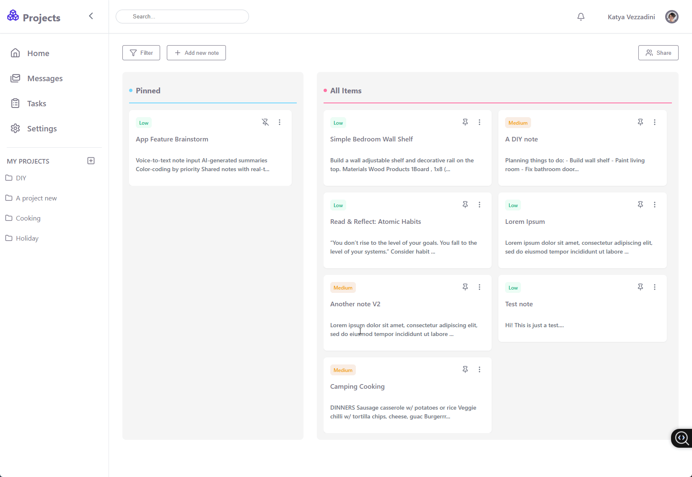

A modern, responsive note-taking web app built with React (Vite) and Supabase. Users can log in, create notes, pin them, assign priorities (low, medium, high), and group them into custom projects.

This is a personal project focused on usability, clean design, and scalable architecture. It is currently a private, login-only app, with additional features planned for future development.

---

## Features
### Implemented
- Supabase auth (session-based login)
- Pin/unpin notes
- Assign notes to custom projects
- Prioritise notes (low / medium / high)
- Persist data using Supabase Postgres
- Responsive UI with TailwindCSS and custom CSS modules

### Upcoming
- Search and filter notes by priority/project
- Share notes with other users
- Project descriptions and extended metadata
- Drag-and-drop reordering of notes

---

## Tech Stack

- **Frontend**: React + Vite
- **Styling**: TailwindCSS, CSS Modules
- **Auth & Database**: Supabase
- **State**: React Hooks

